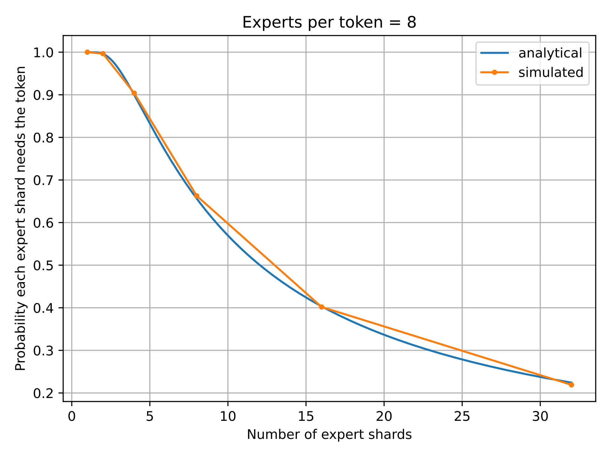
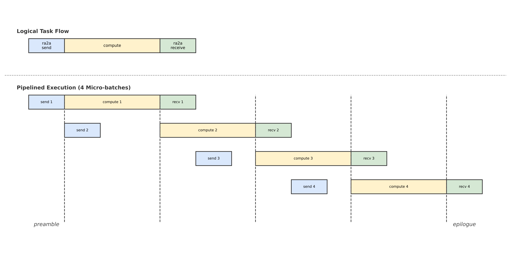
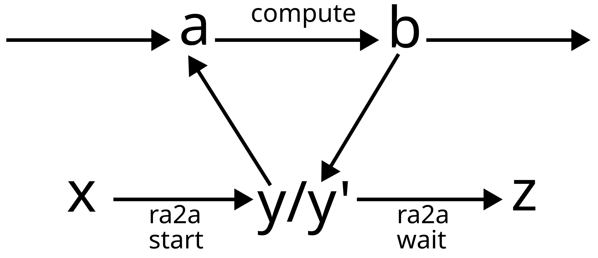

# MoE in JAX

*Work in progress!*

## Expert parallelism

### Alternatives for communicating tokens

In expert parallelism, for an $N$-way expert parallelism, each shard starts with
$\frac{1}{N}$ tokens and $\frac{1}{N}$ of the expert matrices. Annoyingly, in
general, it's a completely random fraction of the tokens which means, at worst,
we might need to make ever shard aware of all the tokens. This sketches out the
first strategy: all-gathering all tokens on all shards. Alternatively, we send
the tokens each shard needs from every shard. Each token is usually routed to
multiple experts, so the final strategy is to route the tokens, then directly
send each version of the routed tokens to the shard which carries the expert for
each.

#### All-gather tokens

This is an attractive strategy because it's very simple.

$$ \underset{\text{RS}}{\text{AG}} \rightarrow \underset{\text{scatter-add}}{\text{gather}} \rightarrow \underset{\text{compute}}{\text{compute}} \rightarrow \underset{\text{gather}}{\text{scatter-add}} \rightarrow \underset{\text{AG}}{\text{RS}} $$

An alternative strategy replaces the gather with broadcast + gather and the scatter-add with gather + sum.

$$ \underset{\text{RS}}{\text{AG}} \rightarrow \underset{\text{sum}}{\text{broadcast}} \rightarrow \underset{\text{gather}}{\text{gather}}
\rightarrow \underset{\text{compute}}{\text{compute}} \rightarrow \underset{\text{gather}}{\text{gather}} \rightarrow \underset{\text{broadcast}}{\text{sum}}
\rightarrow \underset{\text{AG}}{\text{RS}} $$

The total communication required is
  - $B E$ for the all-gather
  - $B E$ for the scatter-add

The total HBM bandwidth required is:
  - first gather $B \left(1 + k \frac{1}{N}\right)$
  - second gather $B \left(1 + k \frac{1}{N}\right)$

#### Ragged all-to-all necessary tokens

$$ \underset{\text{scatter-add}}{\text{gather}} \rightarrow \underset{\text{RA2A}}{\text{RA2A}} \rightarrow \underset{\text{scatter-add}}{\text{gather}} \rightarrow \underset{\text{compute}}{\text{compute}} \rightarrow \underset{\text{gather}}{\text{scatter-add}} \rightarrow \underset{\text{RA2A}}{\text{RA2A}} \rightarrow \underset{\text{gather}}{\text{scatter-add}} $$

The probability that a shard needs a token is

$$
1 - \left(1 - \frac{1}{N}\right)^k
$$

So the total number of tokens to send is 

$$
\frac{B}{N} N \left( 1 - \left(1 - \frac{1}{N}\right)^k \right) = R_t
$$

The total communinication required is:
  - RA2A to send $R_t$
  - RA2A to receive $R_t$

The total HBM bandwidth required is
  - first gather $\frac{B}{N} + R_t$
  - second gather $k \frac{B}{N} + R_t$
  - first scatter-add $k \frac{B}{N} + R_t$
  - second scatter-add $\frac{B}{N} + R_t$

#### Ragged all-to-all after routing

$$ \underset{\text{sum}}{\text{broadcast}} \rightarrow \underset{\text{gather}}{\text{gather}}
\rightarrow \underset{\text{RA2A}}{\text{RA2A}} \rightarrow \underset{\text{gather}}{\text{gather}}
\rightarrow \text{compute}
\rightarrow \underset{\text{gather}}{\text{gather}} \rightarrow \underset{\text{RA2A}}{\text{RA2A}}
\rightarrow \underset{\text{gather}}{\text{gather}} \rightarrow \underset{\text{broadcast}}{\text{sum}} $$

The total communinication required is:
  - RA2A to send $k \frac{B}{N}$
  - RA2A to receive $k \frac{B}{N}$

The total HBM bandwidth required is
  - broadcast & gather $\frac{B}{N} \left(k + 1\right)$
  - second gather $2 \frac{B}{N} k$
  - third gather $2 \frac{B}{N} k$
  - fourth gather $2 \frac{B}{N} k$
  - sum $\frac{B}{N} \left(k + 1\right)$

  

## The problem of individually addressable tokens

On TPU, the two minor-most dimensions need to be multiples of (8, 128), so a 2D
array of tokens (with embedding along the minor-most dimension) cannot be
individually addressable. The ragged-all-to-all routine uses RDMAs on TPU and so
needs groups of tokens to be addressable at an arbitrary offset. This can be
worked around either by reshaping the array into 3 dimension where the embedding
is laid out along both minor-most dimension or by incorporating a padding into
one of the gathers before ragged-all-to-all which alignes chunks to be sent to
the addressable sizes (multiples of 8).

The tokens are typically stored in 2D arrays, so this strategy requies extra HBM movement of
  - 2D -> 3D before entering the MoE block
  - 3D -> 2D for the compute block which might expect a 2D layout
  - 2D -> 3D after the compute block
  - 3D -> 2D afer the MoE block

While most of these can most likely be fused into computation before & after the
MoE block and into the compute in the compute block, this is an immediate TODO.
Moving data between gathers/scatter-adds also appear to be faster in the 3D
layout (this might not be true in general).

## The pipelining strategy

While the pipelining strategy makes perfect sense when drawn like that, it's not
the easiest thing for a compiler to detect and issue. Fortunately, RA2A is
actually quite easy to write in Pallas and in Pallas, collectives can be
decomposed in a start & wait method.

The start and wait method take an extremely small amount of time since the
issuing of RDMAs is very cheap. More accurately, they should take very little
time, but wait will block unless it's called after the communication completed.

The challenge in overlapping is to actually induce a sequential dependency so
that the order is ra2a start, compute (from another microbatch), ra2a wait. This
can be done by using the `jax.lax.optimization_barrier` (preventing reordering)
<b>twice</b> on the `future` output (`y`) of `ra2a_start` call. Firstly tying
the input to the compute and the future returned from `ra2a_start`, then again
to tie the output of the compute to the `future` passed into `ra2a_wait`.

  

## The TPU gathers and scatters

Efficient support for gathers, scatters and scatter-adds (note, these are all
local HBM data movement operations, not collectives) is still a work in
progress, so gathers, scatters and scatter-adds can be costly.

The are several problems:
  - <b>scatter-adds are particularly costly </b> (since they accumulate at an arbitrary memory location, the parallelization opportunities are limited)
  - <b>a general autodiff rule for a gather is a scatter-add</b> (unless unique indices are specified)
  - <b>many of the expert parallelism essentially just sort tokens, so the indices are unique</b>
  - TOOD(rdyro): figure out if the `unique_indices=True` argument actually works
  - the strategy <b>broadcast + gather and gather + sum in the backward pass can beat scatter-adds</b>
